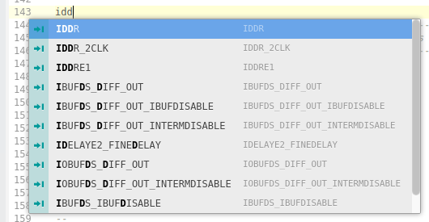
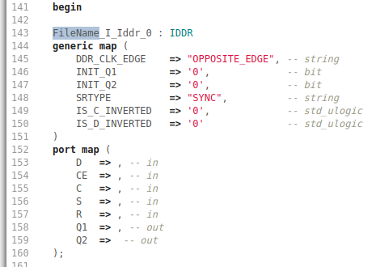

# xilinx-unisims Package

This package provides the Xilinx FPGA Unisim library as a set of **VHDL** snippets.

Xilinx FPGA Unsim libraries are or can be used to instantiate hardware dedicated logic elements 
available in the different FPGA families, elements such as PLL, MMCM , LUT, ...

**Remark:** This package replaces the "Xilinx-Snippets" package.

### Supported  FPGA families

   - Spartan-6
   - All of the 7-Series
- All of Ultrascale and Ultrascale+ devices.
- Primitives of other FPGA families will be add as they are used in my designs.

The list **is not** a complete copy of the Unisim library available in the Xilinx Vivado tool!
It does not contain elements as PCIE, Ethernet MAC, transceivers or other because those elements are too big to instantiate and one will probably never instantiate these anyway because all of these components are typically used through a wizard. The wizard provides an instantiate-able model targeted and customised following what the user demanded through the wizard.

### The simplest way to install this is:
- Install the package from within Atom:
    - [Packages] [Settings View] [Install Packages/Themes]
    - Type in the search box: Xilinx ... and hit enter

### Second way to install this package is:
- Download the zip file from the GitHub page, store it somewhere on the system.
- Unzip it for Microsoft Windows users to:
    -  C:/Users/<Your account>/.atom/packages
- Unzip it for Linux users to:
    - /home/<Your account> /.atom/packages
- After the unzip operation, find a directory/folder *xilinx-unisims* in the *packages* directory.
- Restart atom or start atom to load and use the package.

### Use of the snippet list

- Start typing the first letters of the primitive that needs to be instantiated.
    

​		Select, up/down arrow keys or mouse, and click in the list the wanted component.
​		For some components no list appears, then just hit [Tab] to instantiate the component.

- When the IDDR is instantiated it appears as in below figure
    

- Component labels are build this way:
    ```FileName_I_<Name_of_Primitive>_<number>```
- The instantiated component label starts with *FileName*.
    Replace *FileName* with the name of the file, without extension, the component is instantiated.
    Naming instantiated components this way is done to easily find components in hierarchical designs. 
    As showed the cursor is dropped on the highlighted *FileName* to allow one to change it easily. 
    f the name can be kept, just hit **[Tab]**.
- The cursor jumps now to the second highlighted area, being *0*.
    The is providing the amount of times the primitive is instantiated.
    Change it by typing a number or something else or leave it by hitting **[Tab]**
- Hitting **[Tab]** makes the cursor jump from one port element to another allowing one to change the name of the connected signal or bus. After a signal or bus name is provided, hit [Tab] to jump to the next port.

Regards,
